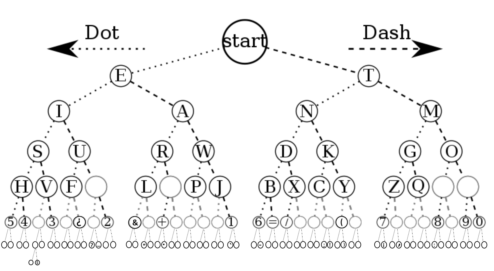
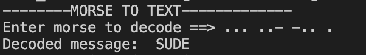
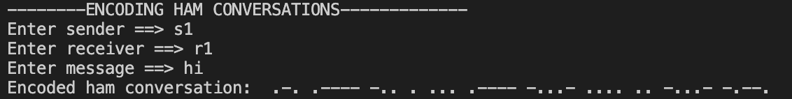
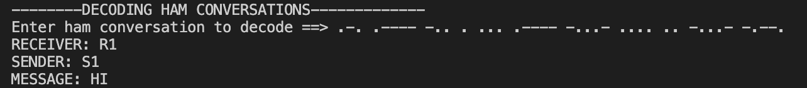
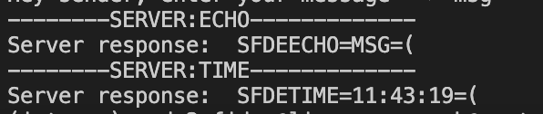
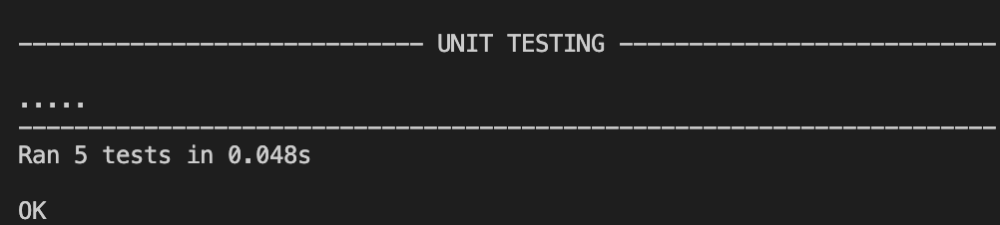

# **WORKSHEET2 - MORSE HEAP**

## 🚀 **Getting Started**

This repository contains python module that creates a binary heap for morse code. By using that module you can do translation between morse code and sentence. Binary Heap uses binary tree to accomplish some features [[Morse Tree](https://gitlab.uwe.ac.uk/s2-fidan/worksheet2part1.git)].



## 🖥️ **How to Run**
0. Ensure you have [python3](https://www.python.org/download/releases/3.0/) installed.
   
   At a command prompt, type `python --version` to ensure you have version 3.
1. Download or clone this repository.
   
   If you download as a zip file, be sure to unzip it.
2. To decode morse code with using binary heap, run main.py
3. To decode and encode ham conversations, run main.py
4. To use echo and time services through WebSocket, run main.py.
5. To do unit testing, run morseunit.py

## 🔧 **Implementations**
**Morse Heap Implementation :** *Tree is implemented with decode_bt(), encode_ham(), decode_ham() functions.*

**Morse Server Implementation :**  Server has two services including echo and time.

**Unit Test Implementation:** *Test are done using assertIn(), assertNotIn(), assertEqual(), assertNotEqual(), assertCountEqual(), assertIsNotNone()*
## 🎯 **Features**
* Translation from morse code to text (decoding)
* Ham conversation from text to morse code(encoding).
* Ham conversation from morse to text code(decoding).
* Echo server service(return echo).
* Time server service(return time).
* Unit testing.

## 🖇️ **Example Usage**

📍 Main.py

1. User can translate from text to morse and morse to text:
```python
#messages
print('--------MORSE TO TEXT-------------')
morse_message = input(('Enter morse to decode ==> ')) 
print('Decoded message: ', morse.decode_bt(morse_message))
```
Expected Output:



Here is some other examples with their expected output to try:

Morse  | Text
------------- | -------------
... ..- -.. . / ..-. .. -.. .- -. | Sude Fidan 
..--- ----- ..--- ...-- / .-.-. / ..--- ----- .---- --.. | 2023 + 2017
.-- . / .-.. --- ...- . / .--. -.-. / -.-.-- | WE LOVE PC !

2. User can have encoded ham radio conversation:
```python
print('--------ENCODING HAM CONVERSATIONS-------------')
sender  = input('Enter sender ==> ') #S1
receiver = input('Enter receiver ==> ') #R1
message = input('Enter message ==> ') #HI
print('Encoded ham conversation: ', MorseHeap.encode_ham(sender,receiver message))
```
Expected Output:



Here is some other examples with their expected output to try:

Sender  | Receiver | Message | Expected Output
------------- | ------------- | ------------- | ------------- 
Sude Fidan | SF | message | ... ..-. -.. . ... ..- -.. . / ..-. .. -.. .- -. -...- -- . ... ... .- --. . -...- -.--.
10 | 11 | 12 | .---- .---- -.. . .---- ----- -...- .---- ..--- -...- -.--.
internet | of the | things | --- ..-. / - .... . -.. . .. -. - . .-. -. . - -...- - .... .. -. --. ... -...- -.--.
benedict | iot | benedict cuberoo | .. --- - -.. . -... . -. . -.. .. -.-. - -...- -... . -. . -.. .. -.-. - / -.-. ..- -... . .-. --- --- -...- -.--.


3. User can have decoded ham radio conversation:

```python
print('--------DECODING HAM CONVERSATIONS-------------')
ham_convo = input(('Enter ham conversation to decode ==> '))
print(morse.decode_ham(ham_convo))
```

Expected Output:



Here is some other examples with their expected output to try:

Conversation | Expected Output
------------- | -------------  
... . -. -.. -.. . .-. . -.-. . .. ...- . -...- -.-. --- -. ...- --- -...- -.--. | RECEIVER: SEND, SENDER: RECEIVE, MESSAGE: CONVO
.---- ..--- ...-- -.. . ....- ..... -.... -...- --... ---.. ----. -...- -.--. | RECEIVER: 123, SENDER: 456, MESSAGE: 789

4. User can use echo and time server functions:
   
Echo server send back the message to sender while time server send back the time of the message has been sent to sender.

```python
print("Echo client")
    asyncio.run(main())
    sender = input(('Hey sender, enter your name ==> ')) #sf
    message = input(('Hey sender, enter your message ==> ')) #msg
    print('--------SERVER:ECHO-------------')
    #ECHO SERVER RESPONSE: SFDEECHO=MSG=( ==>  ... ..-. -.. . . -.-. .... --- -...- -- ... --. -...- -.--.
    print(f'Server response: ', asyncio.run(send_echo(sender,message))) 
    print('--------SERVER:TIME-------------')
    #TIME SERVER RESPONSE: SFDETIME=15:04:21=( ==>  SFDETIME=15:04:21=( ==> time will be changed with server time
    print('Server response: ', asyncio.run(send_time(sender)))
```

Expected Output:



Here is some other examples for echo server with their expected output to try:

Sender | Messge | Expected Echo Output| Expected Time Output
------------- | -------------  | -------------  | ------------- 
s1 | secret | S1DEECHO=SECRET=( | S1DETIME=11:56:28=(
ben | dict | BENDEECHO=DICT=( | BENDETIME=11:57:22=(

❗️Not to forget about time will change in time server


## 💡 **Unit Testing**
📍 Morseunit.py

Program has some unit testing if user wants to test. There are 5 tests available:

1. Testing for decode_bt() function

    Decode_bt function translate from morse to text in the same way with decode function. Here are the examples that are done under testing:
    Assert Function | Message         | Decoded Version     | Message 2   | Comparison | Pass/Fail
    -------------   | ------------- | ------------- | ------------- | ------------- | -------------
    assertIn() | ... ..-. | SF | SF IS MY CAPITALS | True | Pass
    assertEqual() | ...- ... -.-. --- -.. . | VSCODE | VSCODE | True | Pass
    assertCountEqual() | - .... . / . -. -.. | THE END| THE END | True|Pass
    assertEqual() | ..--- ----- ..--- ...-- / -....- / ..--- ----- ..--- ....- | 2023 - 2024| 2023 - 2024 | True | Pass
    assertNotEqual() | .. -. - . .-. -. | INTERN | INTERNET | False|Pass
    assertNotIn() | - .... .. -. --. . |THINGE |I WAS BORN IN 2002 | False|Pass
    

2. Testing for encode_ham() function

    Encode_ham function encodes ham radio conversations. Here are the examples that are done under testing:

    Assert Function | Sender         | Receiver     | Output Message | Test Message | Comparison | Pass/Fail
    -------------   | ------------- | ------------- | ------------- | ------------- | ------------- | -------------  
    assertIn() | send | receive| here| .-. . -.-. . .. ...- . -.. . ... . -. -.. -...- .... . .-. . -...- -.--. | True |Pass
    assertEqual()| Sude Fidan| SF | secret | ... ..-. -.. . ... ..- -.. . / ..-. .. -.. .- -. -...- ... . -.-. .-. . - -...- -.--. | True| Pass
    assertCountEqual() |23 | 20| 2023| ..--- ----- -.. . ..--- ...-- -...- ..--- ----- ..--- ...-- -...- -.--. | True|Pass
    assertEqual() | 23 | 20 | 20 + 17| ..--- ----- -.. . ..--- ...-- -...- ..--- ----- .-.-. .---- --... -...- -.--. |True|Pass
    assertEqual() | SEND | RECEIVE | WE LOVE PC ! | .-. . -.-. . .. ...- . -.. . ... . -. -.. -...- .-- . / .-.. --- ...- . / .--. -.-. / -.-.-- -...- -.--. | True|Pass
    assertNotIn() | benedict | sude | iot | ... ..- -.. . -.. . -... . -. . -.. .. -.-. - -...- .. --- - .-- --- .-. -.- ... .... . . - ..--- -...- -.--. |False|Pass
    assertNotEqual() | internet | of | things | --- ..-. -.. . .. -. - . .-. -. . - -...- .-.. .- ... - / .-- --- .-. -.. -...- -.--. | False|Pass
    

3. Testing for decode_ham() function

    Decode_ham function encodes ham radio conversations. Here are the examples that are done under testing:
    Assert Function | Message         | Decoded Version     | Message 2   | Comparison | Pass/Fail
    -------------   | ------------- | ------------- | ------------- | ------------- | -------------
    assertIn() | R | .-. | .-. -.. . ... -...- .... .. -...- -.--. | True | Pass
    assertEqual() | .---- ..--- -.. . ...-- ....- -...- .... .. -...- -.--.| 12DE34=HI=( | RECEIVER:12, SENDER:34, MESSAGE:HI | True | Pass
    assertCountEqual() | RECEIVER:+, SENDER:-, MESSAGE:HI | .-.-. -.. . -....- -...- .... .. -...- -.--. |.-.-. -.. . -....- -...- .... .. -...- -.--. | True|Pass
    assertEqual() | ..--- .-.-.- ..... -.. . ...-- .-.-.- ..... -...- -- ... --. -...- -.--. | 2.5DE3.5=MSG=(| RECEIVER:2.5, SENDER:3.5, MESSAGE:MSG| True | Pass
    assertNotEqual() | -... . -. -.. . .. -. - . .-. -. . - -...- -- ... --. -...- -.--. | BENDEINTERNET=MSG=( | RECEIVER:BEN, SENDER:INTERNET, MESSAGE:BENEDICT | False|Pass
    assertNotIn() | I WAS BORN IN 2002 |.-. .---- -.. . ... .---- -...- .. / .-- .- ... / -... --- .-. -. / .. -. / ..--- ----- ----- ..--- -...- -.--. |.-. .---- -.. . ... .---- -...- .. / .-- .- ... / -... --- .-. -. / .. -. / ..--- ----- ..--- ...-- -...- -.--. | False|Pass


4. Testing for echo server:

    Echo server sends back an echo message to its sender. Here are the examples that are done under testing:
    Assert Function | Sender         | Message     | Server Result| Message 2  | Comparison | Pass/Fail
    -------------   | ------------- | ------------- | ------------- | ------------- | -------------| -------------
    assertIn() | a | message | ADEECHO=MESSAGE=(|ADEECHO=MESSAGE=( | True | Pass
    assertEqual() | a1 | message | A1DEECHO=MESSAGE=( | A1DEECHO=MESSAGE=( | True | Pass
    assertCountEqual() | a1 b1 | is message too long? | A1B1DEECHO=ISMESSAGETOOLONG?=( | A1B1DEECHO=ISMESSAGETOOLONG?=(| True|Pass
    assertNotEqual() | benedict |here is my message | BENEDICTDEECHO=HEREISMYMESSAGE=( | BENEDICTDEECHO=THISISNOTMYMESSAGE=( |False | Pass
    assertNotIn() | iot |secret123 |IOTDEECHO=SECRET123=( | IOTDEECHO=SECRET!=( | False|Pass

5. Testing for time server:

    Time server sends the time back to its sender. Here are the examples that are done under testing:
    Assert Function | Sender | Server Result| Message 2  | Comparison | Pass/Fail
    -------------   | ------------- | ------------- | ------------- | ------------- | -------------
    assertIn() | 10+10 | 10+10DETIME=00:47:31=( | DE| True | Pass
    assertIn() | sude fidan | SUDE FIDANDETIME=30:31:50=( | =( | True | Pass
    assertIn() | sender | SENDERDETIME=00:47:31=( |TIME | True|Pass
    assertNotEqual() | benedict 2023 | BENEDICT 2023DETIME=00:47:31=( | BENEDICT2023DETIME=14:47:37=( | False(Server time changes) |Pass
    assertIsNotNone() | 2020+2023 | 2020+2023DETIME=09:37:51=( |None | False (It returns something)|Pass


After running all tests expected output:



## 📚 **Library** 
Here is the library for unit testing: [unittest](https://docs.python.org/3/library/unittest.html)
## 📪 **Installation** 
Ensure you have [websocket](https://pypi.org/project/websocket-client/) installed. If you do not have websocket installed: 
   
   At a command prompt, type `python3 setup.py install` or `pip3 install websocket-client` to install.

## 🤓 **Maintainers** 
Sude Fidan(@s2-fidan)
## 📖  **Referencing** 
* https://morsecode.world/international/translator.html
* https://www.geeksforgeeks.org/morse-code-translator-python/


